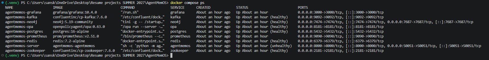
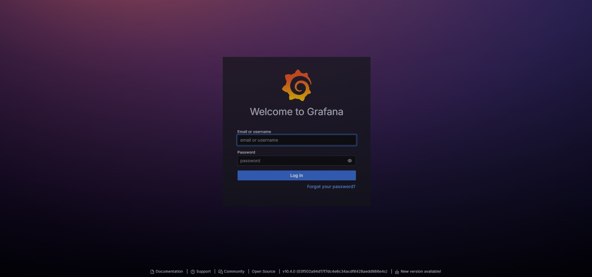
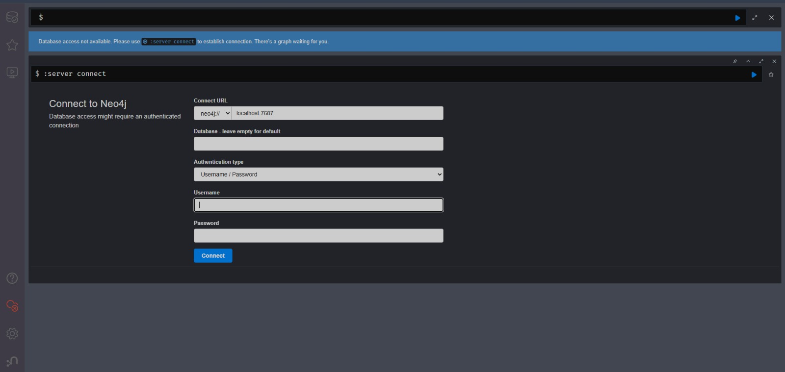
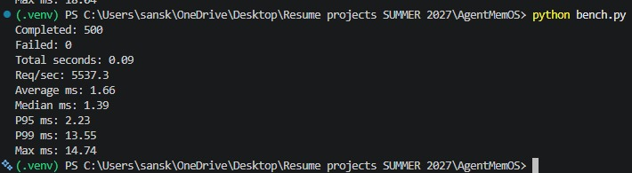

# AgentMemOS

**Prototype Hierarchical Memory System for LLM Agents**

AgentMemOS is a distributed memory management prototype for autonomous AI agents that organizes persistent, cross-session memory across four cognitively inspired tiers: **working**, **episodic**, **semantic**, and **procedural** memory.

It is built to explore how long-running LLM agents can retain context, store prior experiences, preserve workflows, and retrieve relevant knowledge across sessions.

---

# Why AgentMemOS?

Most LLM applications are stateless by default. Once a conversation ends, useful context is often lost unless external memory systems are added.

AgentMemOS explores a structured memory architecture inspired by human cognition:

* **Working Memory** → short-term active context
* **Episodic Memory** → prior interactions and events
* **Semantic Memory** → facts and concepts accumulated over time
* **Procedural Memory** → workflows, tool usage, and reusable processes

This structure helps agents maintain continuity and enables richer long-term behavior.

---

# Architecture

```text
LLM Agent
   │
   ▼
FastAPI / gRPC API Layer
   │
   ▼
Memory Router
   │
   ├── Tier 0: Redis        (Working Memory)
   ├── Tier 1: Pinecone     (Episodic Memory)
   ├── Tier 2: Neo4j        (Semantic Memory)
   └── Tier 3: PostgreSQL   (Procedural Memory)

Supporting Services:
- Consolidation Pipeline
- Metrics Exporter
- Policy Engine
- Kafka Write Log
```

---

# Memory Tiers

| Tier       | Backend    | Purpose                                   |
| ---------- | ---------- | ----------------------------------------- |
| Working    | Redis      | Fast short-term session context           |
| Episodic   | Pinecone   | Vector retrieval over prior interactions  |
| Semantic   | Neo4j      | Structured facts and relationships        |
| Procedural | PostgreSQL | Tool traces, workflows, versioned records |

---

# Core Features

## 1. Multi-Tier Memory Routing

Memories can be routed to the most suitable storage tier depending on type and retrieval needs.

Examples:

* Temporary task context → Redis
* Interaction summaries → Pinecone
* Learned preferences → Neo4j
* Reusable workflows → PostgreSQL

---

## 2. Background Consolidation Pipeline

A scheduled consolidation process transforms short-term memories into more durable knowledge.

Typical stages:

1. Fetch recent episodic memories
2. Cluster related memories
3. Summarize recurring patterns
4. Promote synthesized concepts into semantic memory
5. Archive stale low-value entries

This helps control storage growth while improving memory organization.

---

## 3. Importance-Based Retention

Memories can be ranked using signals such as:

* Recency
* Frequency of reuse
* Relevance
* Novelty
* Successful outcomes

Higher-value memories can be prioritized for retention.

---

## 4. Cross-Agent Federation

Includes policy-based memory sharing primitives for multi-agent systems.

Supported access patterns:

* Public memories
* Team-scoped access
* Agent allowlists
* Field redaction

---

## 5. Observability

Integrated monitoring stack includes:

* Prometheus metrics
* Grafana dashboards
* Health endpoints
* Tier status inspection

---

# Tech Stack

## Backend

* Python 3.11
* FastAPI
* gRPC
* AsyncIO

## Datastores

* Redis
* Pinecone
* Neo4j
* PostgreSQL

## Infrastructure

* Docker Compose
* Kafka
* Open Policy Agent
* Prometheus
* Grafana

---

# Local Benchmark Results

Measured locally in Docker using concurrent synthetic requests against the lightweight `/health` endpoint.

| Metric          | Result        |
| --------------- | ------------- |
| Throughput      | 5,537 req/sec |
| Average latency | 1.66 ms       |
| P95 latency     | 2.23 ms       |
| P99 latency     | 13.55 ms      |

*These numbers reflect local health-check performance, not full memory write/search workloads.*

---
---

# Demo Video

Watch a short walkthrough of AgentMemOS:

[Download / View Demo Video](assets/demo/agentmemos-demo.mp4)

---

# Screenshots

## Swagger API Docs

<p align="center">
  
</p>

FastAPI-generated interactive REST documentation.

---

## Docker Services Running

<p align="center">
  
</p>

Healthy multi-container local environment running Redis, Kafka, Neo4j, PostgreSQL, Prometheus, Grafana, and API services.

---

## Grafana Dashboard

<p align="center">
  
</p>

Metrics visualization for system health and service monitoring.

---

## Neo4j Graph View

<p align="center">
  
</p>

Semantic memory graph storage for concepts and relationships.

---

## Benchmark Results

<p align="center">
  
</p>

Local concurrent benchmark results for `/health` endpoint.

---

# API Surface

## REST

* `GET /health`
* `GET /metrics`
* `GET /agents/{id}/stats`
* `POST /consolidate`
* `POST /rollback`
* `POST /policy`

## gRPC

* Write memory
* Read memory
* Delete memory
* Consolidate memory
* Federated access

---

# Project Structure

```text
AgentMemOS/
├── agentmemos/
│   ├── core/
│   ├── tiers/
│   ├── consolidation/
│   ├── federation/
│   ├── eviction/
│   └── server/
├── assets/screenshots/
├── monitoring/
├── proto/
├── tests/
├── docker-compose.yml
├── Dockerfile
├── pyproject.toml
└── README.md
```

---

# Quick Start

## Clone Repository

```bash
git clone https://github.com/Sanskar121543/AgentMemOS.git
cd AgentMemOS
```

## Configure Environment

Create `.env`

```env
OPENAI_API_KEY=your_key
PINECONE_API_KEY=your_key
JWT_SECRET=your_secret
```

## Launch Services

```bash
docker compose up -d
```

## Open API Docs

```text
http://localhost:8000/docs
```

---

# Example Use Cases

## Personal AI Assistant

Retains preferences, tasks, and recurring context.

## Multi-Agent Research System

Shares memory selectively with policy controls.

## Coding Agent

Stores bug fixes, workflows, and reusable execution traces.

## Enterprise Knowledge Assistant

Builds searchable institutional memory across sessions.

---

# Engineering Highlights

* Built a multi-tier memory architecture across cache, vector, graph, and relational stores
* Implemented asynchronous APIs using FastAPI + gRPC
* Designed a consolidation workflow for long-term memory promotion
* Added observability using Prometheus + Grafana
* Dockerized a full local multi-service environment
* Explored memory systems for persistent LLM agents

---

# Future Improvements

* Kubernetes deployment
* Retrieval ranking improvements
* Cost-aware storage routing
* Local embedding providers
* Fine-grained TTL and retention policies

---

# License

MIT
